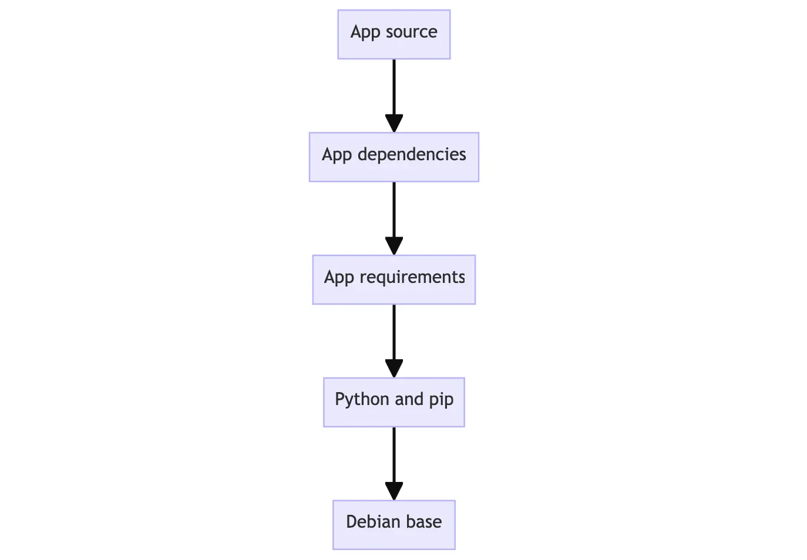

## Docker Images
In Docker container images are composed of layers. And each of these layers, once created, are immutable. But, what does that actually mean? And how are those layers used to create the filesystem a container can use?

### Image layers
Each layer in an image contains a set of filesystem changes - additions, deletions, or modifications. Let’s look at a theoretical image:

1. The first layer adds basic commands and a package manager, such as apt.
2. The second layer installs a Python runtime and pip for dependency management.
3. The third layer copies in an application’s specific requirements.txt file.
4. The fourth layer installs that application’s specific dependencies.
5. The fifth layer copies in the actual source code of the application.
   
This Example might look like:


This is beneficial because it allows layers to be reused between images. For example, imagine you wanted to create another Python application. Due to layering, you can leverage the same Python base. This will make builds faster and reduce the amount of storage and bandwidth required to distribute the images. The image layering might look similar to the following:


## Dockerfile 
A Dockerfile is a text-based document that's used to create a container image. It provides instructions to the image builder on the commands to run, files to copy, startup command, and more.

As an example, the following Dockerfile would produce a ready-to-run Python application:
```shell
FROM python:3.12
WORKDIR /usr/local/app

# Install the application dependencies
COPY requirements.txt ./
RUN pip install --no-cache-dir -r requirements.txt

# Copy in the source code
COPY src ./src
EXPOSE 5000

# Setup an app user so the container doesn't run as the root user
RUN useradd app
USER app

CMD ["uvicorn", "app.main:app", "--host", "0.0.0.0", "--port", "8080"]
```
### Common instructions
Some of the most common instructions in a Dockerfile include:

- FROM <image> - this specifies the base image that the build will extend.
- WORKDIR <path> - this instruction specifies the "working directory" or the path in the image where files will be copied and commands will be executed.
- COPY <host-path> <image-path> - this instruction tells the builder to copy files from the host and put them into the container image.
- RUN <command> - this instruction tells the builder to run the specified command.
- ENV <name> <value> - this instruction sets an environment variable that a running container will use.
- EXPOSE <port-number> - this instruction sets configuration on the image that indicates a port the image would like to expose.
- USER <user-or-uid> - this instruction sets the default user for all subsequent instructions.
- CMD ["<command>", "<arg1>"] - this instruction sets the default command a container using this image will run.

**It's important to note that the Dockerfile has no file extension**

## Building Images
Most often, images are built using a Dockerfile. The most basic `docker build` command might look like the following:
```bash 
docker build .
```
The final `.` in the command provides the path or URL to the build context  . At this location, the builder will find the `Dockerfile` and other referenced files.
When you run a build, the builder pulls the base image, if needed, and then runs the instructions specified in the Dockerfile.

With the previous command, the image will have no name, but the output will provide the ID of the image. As an example, the previous command might produce the following output:
```bash
 => => writing image sha256:9924dfd9350407b3df01d1a0e1033b1e543523ce7d5d5e2c83a724480ebe8f00    0.0s
```

With the previous output, you could start a container by using the referenced image:
```bash
docker run sha256:9924dfd9350407b3df01d1a0e1033b1e543523ce7d5d5e2c83a724480ebe8f00
```
That name certainly isn't memorable, which is where tagging becomes useful.

## Tagging images
Tagging images is the method to provide an image with a memorable name. However, there is a structure to the name of an image. A full image name has the following structure:

```bash
[HOST[:PORT_NUMBER]/]PATH[:TAG]
```
- `HOST`: The optional registry hostname where the image is located. If no host is specified, Docker's public registry at`** docker.io**` is used by default.
- `PORT_NUMBER`: The registry port number if a hostname is provided
- `PATH`: The path of the image, consisting of slash-separated components. For Docker Hub, the format follows `[NAMESPACE/]REPOSITORY`, where namespace is either a user's or organization's name. If no namespace is specified, `library` is used, which is the namespace for Docker Official Images.
- `TAG`: A custom, human-readable identifier that's typically used to identify different versions or variants of an image. If no tag is specified, `latest` is used by default.


Some examples of image names include:
- `nginx`, equivalent to `docker.io/library/nginx:latest` this pulls an image from the `docker.io` registry, the `library` namespace, the `nginx` image repository, and the `latest` tag.
- `docker/welcome-to-docker`, equivalent to `docker.io/docker/welcome-to-docker:latest` this pulls an image from the `docker.io` registry, the `docker` namespace, the `welcome-to-docker` image repository, and the `latest` tag
- `ghcr.io/dockersamples/example-voting-app-vote:pr-311` this pulls an image from the GitHub Container Registry, the `dockersamples` namespace, the `example-voting-app-vote` image repository, and the `pr-311` tag

To tag an image during a build, add the `-t` or `--tag` flag:
```bash
docker build -t my-username/my-image .
```
If you've already built an image, you can add another tag to the image by using the `docker image tag`  command:
```bash
docker image tag my-username/my-image another-username/another-image:v1
```

## Publishing images
Once you have an image built and tagged, you're ready to push it to a registry. To do so, use the `docker push`  command:
```bash
docker push my-username/my-image
```
Within a few seconds, all of the layers for your image will be pushed to the registry.

- **Requiring authentication**
  - Before you're able to push an image to a repository, you will need to be authenticated. To do so, simply use the 
    ```bash
    docker login  
    ```
    command.


